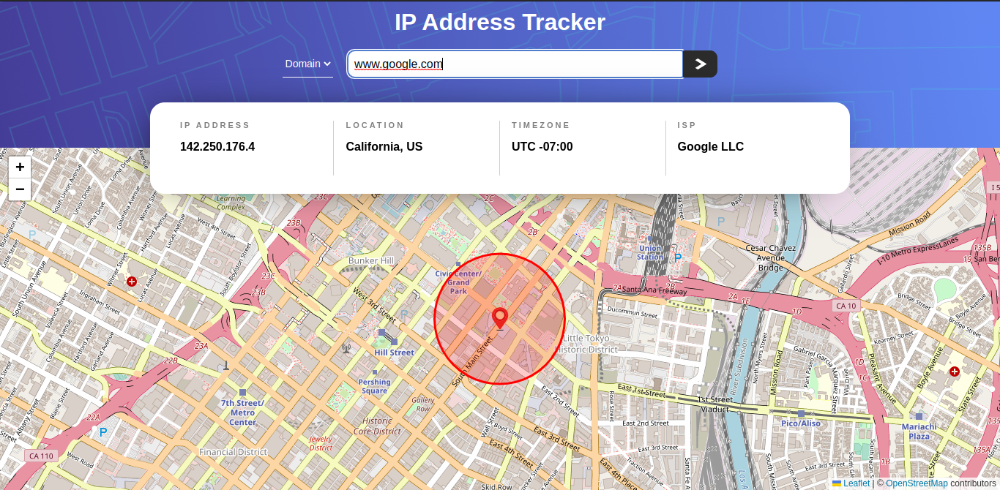
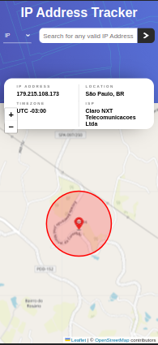

# Frontend Mentor - IP address tracker solution

This is a solution to the [IP Address Tracker challenge on Frontend Mentor](https://www.frontendmentor.io/challenges/ip-address-tracker-I8-0yYAH0). Frontend Mentor challenges help you improve your coding skills by building realistic projects. 

## Table of contents

- [Overview](#overview)
  - [The challenge](#the-challenge)
  - [Screenshots](#screenshots)
  - [Links](#links)
- [My process](#my-process)
  - [Built with](#built-with)
  - [What I learned](#what-i-learned)
  - [Useful resources](#useful-resources)
- [Author](#author)

## Overview

### The challenge

Users should be able to:

- View the optimal layout for each page depending on their device's screen size
- See their own IP address on the map on the initial page load
- Search for any IP addresses or domains and see the key information and location

## Screenshots

### PC:

### Mobile:

## Deploy Link

### [Netlify](https://ipdomain-tracker.netlify.app/)

## My process

### Built with

- Semantic HTML5 markup
- CSS custom properties
- Flexbox
- Responsive Design
- [React.js](https://reactjs.org/)
- React Hooks
- Context API
- [IP Geolocation API](https://geo.ipify.org/) - For IP Info
- [React Leaflet](https://react-leaflet.js.org/) - For the Map Generation

### What I learned

The main new functionality I learned in this project was the generation of an interactive map that focuses on a specific address based on its coordinates.

### Useful resources

- [Geo Location API Docs](https://geo.ipify.org/docs) - This helped me to learn how to use the Geo Location API
- [React Leaflet Docs](https://react-leaflet.js.org/docs/start-introduction/) - This helped me to learn how to use the React Leaflet

## Author

- Frontend Mentor - [@vinicius-melo99](https://www.frontendmentor.io/profile/vinicius-melo99)
- [LinkedIn](https://www.linkedin.com/in/vinicius-s-melo/)

